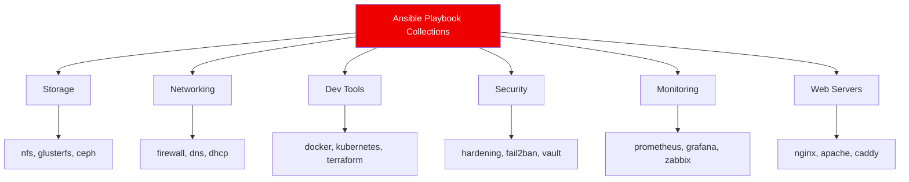
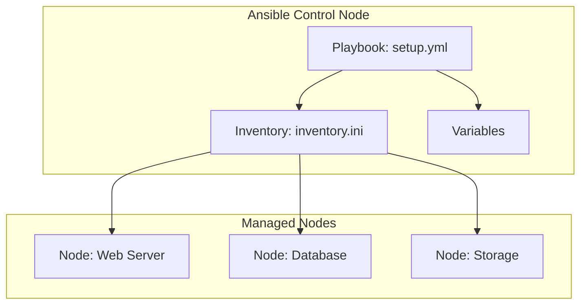
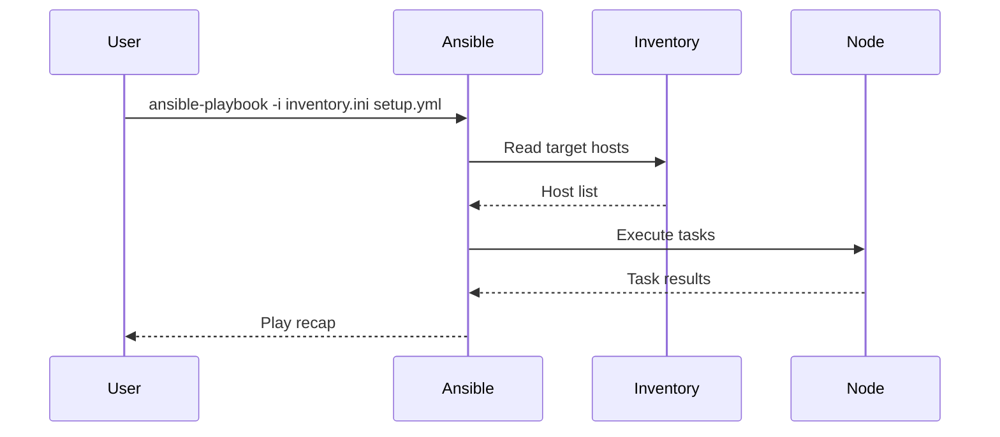

<div align="center">

  

  <a href="LICENSE"></a>
  
  

  <p><strong>Ready-to-use Ansible playbooks for infrastructure automation and configuration management.</strong></p>
</div>

## Table of Contents

- [Overview](#overview)
- [Architecture](#architecture)
- [Available Playbooks](#available-playbooks)
- [Quick Start](#quick-start)
- [Mermaid Diagrams](#mermaid-diagrams)
- [Guidelines](#guidelines)
- [References](#references)
- [Contributing](#contributing)
- [License](#license)

---

## Overview

This repository is a practical collection of Ansible playbooks for common infrastructure tasks and configuration management.
Each folder contains a playbook you can run quickly and customize for your environment.

## What You Will Find

- Pre-configured playbooks for common services and tooling
- Playbook examples with inventory files and variables
- Service-specific README files with setup, usage, and operational notes
- Configurations that are easy to adapt for local labs and small deployments

## Architecture



## Available Playbooks

### Storage

- [nfs](./nfs)
- [samba](./samba)

### Testing & Simulation

- [lookbusy](./lookbusy)

## Quick Start

1. Clone the repository:
   ```bash
   git clone https://github.com/marcuwynu23/ansible-playbook-collections.git
   ```
2. Enter a playbook directory:
   ```bash
   cd ansible-playbook-collections/<playbook-folder>
   ```
3. Configure inventory:
   ```bash
   cp inventory.ini.example inventory.ini
   # Edit inventory.ini with your target hosts
   ```
4. Run the playbook:
   ```bash
   ansible-playbook -i inventory.ini setup.yml
   ```
5. Tear down (if applicable):
   ```bash
   ansible-playbook -i inventory.ini removal.yml
   ```

## Mermaid Diagrams





## Guidelines

### Best Practices

1. **Use inventory files** to define target hosts
2. **Use variables** for environment-specific values
   ```yaml
   nfs_exports:
     - path: /data
       clients: "192.168.1.0/24(rw,sync)"
   ```
3. **Use roles** for reusable task organization
4. **Use tags** for selective task execution
   ```bash
   ansible-playbook -i inventory.ini setup.yml --tags "nfs,storage"
   ```
5. **Test with `--check`** before applying changes
   ```bash
   ansible-playbook -i inventory.ini setup.yml --check --diff
   ```

### Troubleshooting

| Problem | Solution |
|---|---|
| SSH connection failed | Verify SSH keys and host reachability |
| Permission denied | Use `--become` or `--ask-become-pass` |
| Variable not defined | Check group_vars and host_vars |
| Task skipped | Check conditionals and tags |

### Useful Commands

```bash
ansible-playbook -i inventory.ini setup.yml
ansible-playbook -i inventory.ini setup.yml --check
ansible-playbook -i inventory.ini setup.yml --diff
ansible-playbook -i inventory.ini setup.yml --tags "nfs"
ansible-playbook -i inventory.ini setup.yml --limit "webservers"
ansible-playbook -i inventory.ini removal.yml
ansible-inventory -i inventory.ini --list
```

## References

- [Ansible Official Docs](https://docs.ansible.com/)
- [Ansible Playbooks](https://docs.ansible.com/ansible/latest/playbook_guide/)
- [Ansible Inventory](https://docs.ansible.com/ansible/latest/inventory_guide/)
- [Ansible Best Practices](https://docs.ansible.com/ansible/latest/playbook_guide/playbooks_best_practices.html)
- [Ansible Community](https://forum.ansible.com/)

## Contributing

Contributions are welcome.
If you want to add or improve a playbook, open a pull request with a short description of the use case and configuration.

## License

This project is licensed under the MIT License.
