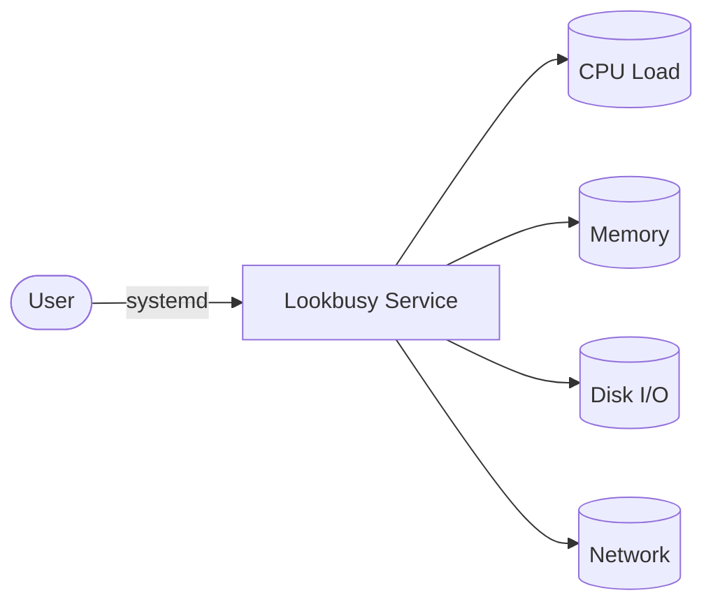

# Lookbusy

Lookbusy playbook to install and configure Lookbusy, a tool to simulate CPU, memory, disk, and network activity on Linux systems.  
This setup supports Debian/Ubuntu, RedHat family, SUSE, and Arch.

## How it works



1. Installs Lookbusy packages based on the detected OS family.
2. Creates a systemd service to run Lookbusy with configurable parameters.
3. Enables and starts the Lookbusy service.

## Playbook details in this repo

- Supported OS: Debian/Ubuntu, RedHat (Fedora, RHEL, CentOS, Rocky, Alma), SUSE, Arch
- Default CPU percent: `50`
- Default memory: `512 MB`
- Default disk path: `/tmp`
- Default network interface: `eth0`
- Service: `lookbusy` (systemd)

## Variables

| Variable | Default | Description |
|---|---|---|
| `lookbusy_cpu_percent` | `50` | CPU usage percentage to simulate |
| `lookbusy_mem_mb` | `512` | Memory usage in MB to simulate |
| `lookbusy_disk_path` | `/tmp` | Path for disk I/O simulation |
| `lookbusy_disk_io_mb` | `100` | Disk I/O size in MB |
| `lookbusy_network_interface` | `eth0` | Network interface for traffic simulation |
| `lookbusy_network_mbps` | `10` | Network bandwidth in Mbps |
| `lookbusy_manage_firewall` | `false` | Manage firewall rules |

## How to run

From the repository root:

```bash
cd lookbusy
cp inventory.ini.example inventory.ini
ansible-playbook -i inventory.ini setup.yml
```

Remove:

```bash
ansible-playbook -i inventory.ini removal.yml
```

Useful commands:

```bash
ansible-playbook -i inventory.ini setup.yml --check
ansible-playbook -i inventory.ini setup.yml --diff
ansible-playbook -i inventory.ini setup.yml -e lookbusy_cpu_percent=75
ansible-playbook -i inventory.ini setup.yml -e lookbusy_mem_mb=1024
```

## Notes

- Lookbusy is useful for testing monitoring, alerting, and resource-based automation.
- Adjust `lookbusy_cpu_percent` and `lookbusy_mem_mb` to match your testing needs.
- Use `--check --diff` to preview changes before applying.

## References

- Official site: <https://www.lookbusy.org/>
- GitHub repo: <https://github.com/lookbusy/lookbusy>
- Arch Wiki: <https://wiki.archlinux.org/title/Systemd>
- Ansible systemd module: <https://docs.ansible.com/ansible/latest/collections/ansible/builtin/systemd_module.html>
