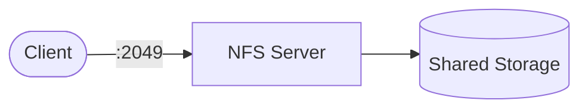

# NFS

NFS (Network File System) playbook to install and configure an NFS server for sharing directories over a network.  
This setup supports Debian/Ubuntu, RedHat family, SUSE, and Arch.

## How it works



1. Installs NFS packages based on the detected OS family.
2. Creates the export directory with configurable permissions.
3. Configures `/etc/exports` with the allowed network and options.
4. Enables and starts the NFS service.
5. Opens firewall ports (firewalld or ufw) if a firewall is running.

## Playbook details in this repo

- Supported OS: Debian/Ubuntu, RedHat (Fedora, RHEL, CentOS, Rocky, Alma), SUSE, Arch
- Default export path: `/srv/nfs/share`
- Default allowed network: `0.0.0.0/0`
- Default export options: `rw,sync,no_subtree_check`
- Service: `nfs-kernel-server` (Debian/SUSE), `nfs-server` (RedHat/Arch)
- Firewall ports: `nfs`, `mountd`, `rpc-bind` (firewalld) or `2049` (ufw)

## Variables

| Variable | Default | Description |
|---|---|---|
| `nfs_export_path` | `/srv/nfs/share` | Directory to export |
| `nfs_allowed_network` | `0.0.0.0/0` | Network allowed to mount |
| `nfs_export_options` | `rw,sync,no_subtree_check` | Export options |
| `nfs_export_owner` | `root` | Owner of the export directory |
| `nfs_export_group` | `root` | Group of the export directory |
| `nfs_export_mode` | `0755` | Permissions of the export directory |
| `nfs_manage_firewall` | `true` | Open/close firewall ports |

## How to run

From the repository root:

```bash
cd nfs
cp inventory.ini.example inventory.ini
ansible-playbook -i inventory.ini setup.yml
```

Remove:

```bash
ansible-playbook -i inventory.ini removal.yml
ansible-playbook -i inventory.ini removal.yml -e nfs_remove_export_dir=true
```

Useful commands:

```bash
ansible-playbook -i inventory.ini setup.yml --check
ansible-playbook -i inventory.ini setup.yml --diff
ansible-playbook -i inventory.ini setup.yml -e nfs_allowed_network=192.168.1.0/24
ansible-playbook -i inventory.ini setup.yml -e nfs_export_path=/data/share
```

## Notes

- Restrict `nfs_allowed_network` to your trusted network in production.
- Use `--check --diff` to preview changes before applying.
- The removal playbook keeps the export directory by default; set `nfs_remove_export_dir=true` to delete it.

## References

- Official site: <https://nfs.sourceforge.net/>
- Debian NFS guide: <https://wiki.debian.org/NFSServer>
- RedHat NFS guide: <https://access.redhat.com/documentation/en-us/red_hat_enterprise_linux/9/html/managing_file_systems/index>
- Arch Wiki: <https://wiki.archlinux.org/title/NFS>
- Ansible systemd module: <https://docs.ansible.com/ansible/latest/collections/ansible/builtin/systemd_module.html>
